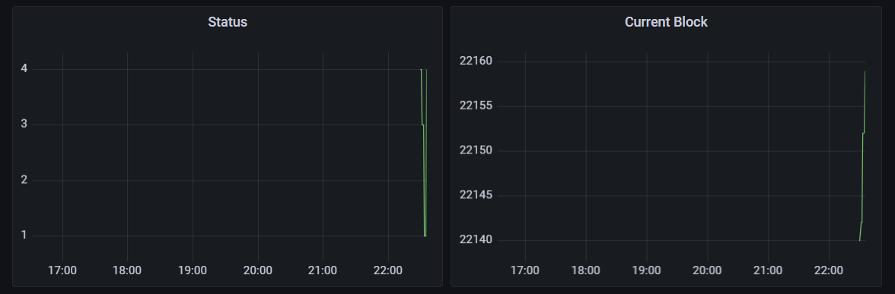

## Aleo RPC exporter to Prometheus

Converts available RPC calls into prometheus-compatible calls.



### Install

```
$ wget https://dl.google.com/go/go1.17.3.linux-amd64.tar.gz && \
  tar -xvf go1.17.3.linux-amd64.tar.gz && \
  git clone https://github.com/unordered-set/AleoRPC2Prometheus.git && \
  cd AleoRPC2Prometheus && PATH="../go/bin:$PATH" go build server.go
```

### Feedback

Discord: Kostya#3379

Telegram: https://t.me/+SYAiIN1gxUBmae8I
